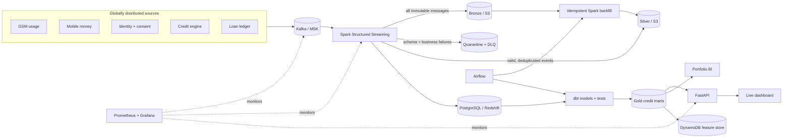

# FinPulse — Real-Time Credit Data Platform

FinPulse is a production-style data engineering portfolio project for inclusive digital lending. It ingests high-volume GSM, device, mobile-money, loan, and repayment events across five African markets; validates and curates them with Spark; stores them in a medallion lakehouse; publishes governed credit marts; and serves live operational, portfolio, and model-risk analytics.

This is an original reference implementation built with synthetic data. It is not affiliated with JUMO and contains no real customer data.

## What this demonstrates

| Capability | Implementation |
|---|---|
| Streaming ingress | Kafka-compatible Redpanda, keyed partitioning, idempotent producers, versioned events |
| Big-data processing | Spark Structured Streaming, event-time watermarks, deduplication, DLQ/quarantine, micro-batch metrics |
| Batch processing | Date-scoped Spark backfill, dynamic partition replacement, Airflow daily curation |
| Lakehouse | S3-compatible MinIO locally; encrypted/versioned S3 and Glue Catalog on AWS; bronze/silver/gold layout |
| Warehouse | PostgreSQL development warehouse with Redshift-compatible dimensional models; Redshift Serverless IaC |
| Analytics engineering | dbt staging, intermediate, feature, portfolio, country, and model-monitoring models with tests |
| Orchestration | Airflow freshness, volume, dbt build, test, audit, and table-maintenance workflow |
| Data quality | Pydantic contract validation, Spark rules, quarantine, dbt tests, quality audit tables |
| Observability | Structured JSON logs, Prometheus metrics, Grafana dashboard, freshness and latency SLOs |
| Serving and BI | FastAPI read-only analytics service and a live Streamlit executive dashboard |
| Cloud and deployment | Terraform for MSK, S3, Glue, Redshift, EMR Serverless, DynamoDB, KMS, IAM, SNS; Kubernetes manifests |
| Engineering practice | Unit/integration tests, CI matrix, container builds, contract artifacts, linting, runbooks, ADRs |

## Architecture



The system models a real data product lifecycle: source contracts → ingress → curation → quality gates → reusable data products → serving → monitoring → incident response.

## Five-minute local demo

The portable path proves the contracts, quality rules, deduplication, dimensional loading, feature aggregation, and portfolio marts without requiring Docker:

```bash
cp .env.example .env
make install
make local-demo
```

The command generates 10,000 coherent events and produces:

```text
artifacts/local-demo/
├── bronze/events.jsonl        # immutable raw records
├── quarantine/events.jsonl    # deliberately malformed records
├── finpulse.db                # queryable SQLite demo warehouse
├── quality-report.json        # machine-readable quality results
├── demo-summary.json          # portfolio and pipeline KPIs
└── lineage.json               # portable lineage manifest
```

Try a warehouse query:

```bash
sqlite3 -header -column artifacts/local-demo/finpulse.db \
  "select * from mart_country_performance order by applications desc;"
```

## Full streaming demo

Requirements: Docker with at least 8 GB allocated. The core profile starts PostgreSQL, Kafka/Redpanda, MinIO, the event producer, Spark processor, API, and dashboard.

```bash
cp .env.example .env
make up
make logs
```

Open:

| Interface | URL | Credentials |
|---|---|---|
| FinPulse dashboard | http://localhost:8501 | none |
| API and OpenAPI | http://localhost:8000/docs | none |
| Kafka console | http://localhost:8080 | none |
| MinIO console | http://localhost:9001 | `finpulse` / `finpulse-secret` |

Optional production capabilities are separated into profiles to keep the first run approachable:

```bash
make orchestrate  # Airflow: http://localhost:8088, admin/admin
make observe      # Grafana: http://localhost:3000, admin/admin
make dbt-test
make smoke
```

Stop everything with `make down`.

## The business data product

FinPulse does more than count technical events. Its curated layer answers concrete credit questions:

- Which markets sit on the best growth–risk frontier?
- How does approval rate vary against PAR30 and average score?
- Which GSM and mobile-money features are available for each applicant?
- Is the credit model’s score distribution or approval rate drifting?
- How fresh is the decision data, and where are events being quarantined?
- Can an application be traced from source event to portfolio mart and API response?

The synthetic generator is stateful: customers register before activity; decisions reference real applications; repayments reference approved applications; and a latent risk factor influences usage, scores, decisions, and late payment. This creates credible correlations for an interview demo without exposing personal data.

## Event contract and privacy

Every event has a UUID, UTC event and ingestion timestamps, schema version, source, country, pseudonymous customer ID, correlation ID, trace ID, and discriminated payload. Contracts reject unknown fields and impossible values. Raw phone numbers and device identifiers never enter the analytical contract; they are salted hashes at ingress.

```json
{
  "event_id": "...",
  "schema_version": "1.0",
  "event_type": "mobile_money_transaction",
  "occurred_at": "2026-08-05T15:30:00Z",
  "ingested_at": "2026-08-05T15:30:00.420Z",
  "source_system": "mobile_money",
  "country_code": "KEN",
  "customer_id": "...",
  "correlation_id": "...",
  "trace_id": "...",
  "payload": {
    "event_type": "mobile_money_transaction",
    "transaction_type": "merchant_pay",
    "amount": 1250.0,
    "currency": "KES",
    "counterparty_hash": "...",
    "channel": "ussd"
  }
}
```

Generate the full JSON Schema with `finpulse schema`.

## Reliability model

- Kafka producers use `acks=all`, idempotence, compression, bounded batching, customer-key partitioning, and explicit delivery callbacks.
- Spark retains immutable bronze input before curation, uses event-time watermarks, and deduplicates by globally unique event ID.
- Structural and business-rule failures go to both an inspectable S3 quarantine zone and a replayable Kafka DLQ.
- Spark checkpoints live outside the compute container. Warehouse event IDs are primary keys, making downstream loads safe to replay.
- Batch backfills replace only selected date partitions; dbt picks the latest credit decision per application.
- Airflow refuses to publish a daily product if freshness, volume, or dbt quality gates fail.
- SLO metrics expose input freshness, throughput, lag, quarantine rate, API latency, and pipeline status.

See [docs/RUNBOOK.md](docs/RUNBOOK.md) for failure scenarios and recovery commands.

## Repository guide

```text
src/finpulse/
├── contracts.py              versioned domain event contracts
├── generator.py              coherent multi-market synthetic source
├── producer.py               idempotent Kafka producer
├── streaming/spark_job.py    bronze, quality, DLQ, silver, warehouse stream
├── batch/backfill.py         partition-scoped historical replay
├── quality/                  reusable business rules and reports
├── api/main.py               metrics and analytics serving layer
├── dashboard/app.py          portfolio and platform BI
└── local_pipeline.py         zero-infrastructure end-to-end demo
airflow/dags/                 production orchestration
dbt/                          tested warehouse transformations
sql/                          operational warehouse schema and views
monitoring/                   Prometheus and provisioned Grafana dashboard
infra/terraform/              AWS reference architecture
infra/kubernetes/             deployment, autoscaling, policy, Spark operator
tests/                        contract, generator, quality, integration tests
docs/                         architecture, demo, runbook, data product, ADRs
```

## Developer workflow

```bash
make install
make format
make lint
make test
make local-demo
```

CI repeats these checks, exports contract/demo artifacts, validates Terraform, and builds each application container independently.

## AWS deployment reference

The Terraform is intentionally a reference deployment rather than something automatically applied from CI. Cloud resources can incur meaningful cost.

```bash
cd infra/terraform
cp terraform.tfvars.example terraform.tfvars
terraform init
terraform plan -out=finpulse.tfplan
terraform apply finpulse.tfplan
```

It provisions a private, encrypted data plane using MSK Serverless, S3/Glue, Redshift Serverless, EMR Serverless, DynamoDB, KMS, Secrets Manager, IAM, CloudWatch, and SNS. Kubernetes manifests target EKS and assume the Spark Operator and workload identity are already installed.

## Interview walkthrough

Use [docs/DEMO.md](docs/DEMO.md) for an eight-minute script that starts with the business problem, follows one event through the system, demonstrates failure handling, and ends with the AWS scaling path and engineering tradeoffs.

## License

MIT. See [LICENSE](LICENSE).

